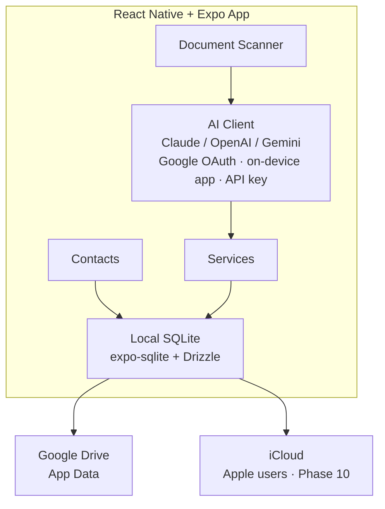

# PRM — Personal Resource Manager
## Application Plan

---

## Context

PRM is a cross-platform mobile app (iOS + Android) that lets users manage two core domains of their life in one place:

1. **Contacts + their context** — people and organisations, enriched with relationship notes, tags, and interaction history beyond what a standard address book offers.
2. **Services** — accounts, insurance policies, and subscriptions, including document upload with AI-powered data extraction.

**Guiding principle**: The user owns their data. No central database — data lives in the user's own cloud (Google Drive / iCloud) with a local SQLite cache for offline access. No backend server is required.

---

## Architecture: Client-First, No Backend



**No proxy server. No Firebase. No central DB.**

---

## Tech Stack

| Layer | Choice | Rationale |
|---|---|---|
| Framework | React Native + Expo SDK 52+ | Managed workflow, Expo SDK covers camera/files/auth |
| Navigation | Expo Router v4 (file-based) | Deep linking, typed routes, tab + stack layouts |
| Local DB | expo-sqlite + Drizzle ORM | Type-safe SQL schema, migrations built-in |
| Secure Storage | expo-secure-store | Keychain (iOS) / Keystore (Android) for API keys |
| State | Zustand | Lightweight, no boilerplate |
| Server State | TanStack Query | Caching, loading states for cloud sync ops |
| Google Auth + Drive | @react-native-google-signin/google-signin + Drive REST API | OAuth2 token → Drive App Data API |
| Apple Auth | expo-apple-authentication | Sign in with Apple, identity token |
| iCloud Sync | expo-file-system + iCloud config plugin (Phase 2) | Requires EAS Build / bare workflow |
| Contacts Import | expo-contacts | Read device address book |
| Document Picker | expo-document-picker | PDF, images from Files |
| Camera | expo-image-picker | Capture document photos |
| Notifications | expo-notifications | Local scheduling for renewal reminders |
| AI Client | fetch (to Claude / OpenAI / Gemini) | User's own key, configurable provider |
| Forms | react-hook-form + zod | Validation with schema inference |
| UI | React Native Paper | Material Design 3, good iOS/Android parity |
| Dates | date-fns | Lightweight, tree-shakable |

---

## Data Model (SQLite via Drizzle)

### contacts
```
id              TEXT PRIMARY KEY  (uuid)
name            TEXT NOT NULL
email           TEXT
phone           TEXT
company         TEXT
role            TEXT
relationship    TEXT              (family | friend | professional | vendor)
notes           TEXT
tags            TEXT              (JSON string array)
source          TEXT              (manual | device | google | apple)
avatarUri       TEXT
createdAt       INTEGER           (unix ms)
updatedAt       INTEGER
```

### contact_interactions
```
id              TEXT PRIMARY KEY
contactId       TEXT              FK → contacts
type            TEXT              (call | email | meeting | note)
date            INTEGER
notes           TEXT
createdAt       INTEGER
```

### services
```
id              TEXT PRIMARY KEY
name            TEXT NOT NULL
category        TEXT NOT NULL     (account | insurance | subscription)
provider        TEXT
accountNumber   TEXT
website         TEXT
startDate       INTEGER
renewalDate     INTEGER
expiryDate      INTEGER
cost            REAL
costCurrency    TEXT              (default 'USD')
costFrequency   TEXT              (monthly | annual | one-time)
status          TEXT              (active | inactive | cancelled | pending)
contactId       TEXT              FK → contacts (optional: linked contact/agent)
notes           TEXT
tags            TEXT              (JSON string array)
reminderDays    INTEGER           (days before renewal to notify, default 7)
createdAt       INTEGER
updatedAt       INTEGER
```

### documents
```
id              TEXT PRIMARY KEY
serviceId       TEXT              FK → services (nullable — unattached)
name            TEXT
localPath       TEXT              (expo-file-system URI)
cloudUrl        TEXT              (Drive / iCloud URL after sync)
mimeType        TEXT
extractedData   TEXT              (JSON — raw AI extraction result)
extractionStatus TEXT             (pending | done | failed)
createdAt       INTEGER
updatedAt       INTEGER
```

### settings (key-value)
```
key             TEXT PRIMARY KEY
value           TEXT
```

---

## Project Structure

```
prm/
├── app/                            # Expo Router file-based routes
│   ├── (auth)/
│   │   └── login.tsx               # Google + Apple sign-in screen
│   ├── (tabs)/
│   │   ├── contacts/
│   │   │   ├── index.tsx           # Contact list + search
│   │   │   ├── [id].tsx            # Contact detail + context + history
│   │   │   ├── new.tsx             # Create contact form
│   │   │   └── import.tsx          # Import from device contacts
│   │   ├── services/
│   │   │   ├── index.tsx           # Service list grouped by category
│   │   │   ├── [id].tsx            # Service detail + documents
│   │   │   ├── new.tsx             # Create service form
│   │   │   └── scan.tsx            # Document scan → AI extract → pre-fill form
│   │   ├── settings/
│   │   │   ├── index.tsx           # Settings home
│   │   │   ├── ai.tsx              # AI provider + API key + model
│   │   │   ├── account.tsx         # Google / Apple account + sync status
│   │   │   └── notifications.tsx   # Reminder defaults
│   │   └── _layout.tsx             # Tab bar (Contacts | Services | Settings)
│   └── _layout.tsx                 # Root layout + auth gate
│
├── components/
│   ├── contacts/
│   │   ├── ContactCard.tsx
│   │   ├── ContactForm.tsx
│   │   ├── ContextSection.tsx      # Notes + tags + relationship
│   │   └── InteractionLogList.tsx
│   ├── services/
│   │   ├── ServiceCard.tsx
│   │   ├── ServiceForm.tsx
│   │   ├── CategoryPicker.tsx
│   │   ├── DocumentAttachment.tsx
│   │   └── RenewalBadge.tsx        # Days until renewal indicator
│   └── shared/
│       ├── SearchBar.tsx
│       ├── TagInput.tsx
│       ├── DatePickerField.tsx
│       ├── SectionHeader.tsx
│       └── EmptyState.tsx
│
├── lib/
│   ├── db/
│   │   ├── schema.ts               # Drizzle table definitions
│   │   ├── migrations/             # Auto-generated migration files
│   │   └── index.ts                # DB singleton
│   ├── ai/
│   │   ├── client.ts               # Unified AI caller (Claude / OpenAI / Gemini)
│   │   ├── prompts.ts              # System + user prompts for extraction
│   │   └── types.ts                # ExtractionResult schema (zod)
│   ├── sync/
│   │   ├── googleDrive.ts          # Drive App Data read/write
│   │   ├── icloud.ts               # iCloud sync (Phase 2 stub)
│   │   └── syncManager.ts          # Orchestrate sync on app foreground
│   ├── auth/
│   │   ├── google.ts               # Google Sign-In + OAuth token management
│   │   └── apple.ts                # Apple Sign-In
│   ├── storage/
│   │   ├── secureStorage.ts        # API keys via expo-secure-store
│   │   └── fileStorage.ts          # Document file copy + cloud upload
│   └── notifications/
│       └── scheduler.ts            # Schedule / cancel renewal reminders
│
├── hooks/
│   ├── useContacts.ts              # CRUD + search against local DB
│   ├── useServices.ts
│   ├── useSync.ts                  # Trigger + observe sync state
│   ├── useAI.ts                    # Call AI client with settings from store
│   └── useNotifications.ts
│
├── stores/
│   ├── authStore.ts                # Signed-in user, provider, OAuth token
│   ├── settingsStore.ts            # AI provider, model, reminder defaults
│   └── syncStore.ts                # Last sync time, sync status
│
└── constants/
    ├── serviceCategories.ts
    ├── currencies.ts
    └── reminderOptions.ts
```

---

## Key Feature Flows

### 1. Authentication
```
App launch
  → no session → (auth)/login.tsx
  → Google: GoogleSignIn.signIn() → get idToken + accessToken
  → Apple: AppleAuthentication.signInAsync() → get identityToken
  → Store tokens in Zustand (authStore) + accessToken in expo-secure-store
  → Navigate to (tabs)/
```

### 2. AI Document Extraction
```
Services/scan.tsx
  1. User picks file (expo-document-picker) or takes photo (expo-image-picker)
  2. If PDF: render first page via expo-print → capture as image
  3. Encode image to base64
  4. Read AI config from settingsStore (provider, model)
  5. Read API key from expo-secure-store
  6. Call lib/ai/client.ts → POST to provider's API with:
       - System prompt: "Extract service info, return JSON"
       - Image content block (base64)
  7. Parse response → validate with zod ExtractionResult schema
  8. Navigate to services/new.tsx with pre-filled form values
  9. User reviews / edits → confirm → save to DB
 10. Attach document record to service
```

**AI Client (lib/ai/client.ts)** handles provider switching:
```typescript
// Claude: messages.create with image content block
// OpenAI: chat.completions.create with image_url content
// Gemini: generateContent with inlineData part
// All return → ExtractionResult (zod validated)
```

**Extraction prompt targets these fields:**
`name, provider, category, accountNumber, startDate, renewalDate, expiryDate, cost, costCurrency, costFrequency`

### 3. Google Drive Sync
```
lib/sync/googleDrive.ts
  - Uses accessToken from authStore
  - App Data folder (not visible in user's Drive UI, not counted against quota*)
  - On sync:
    1. GET /appdata/prm-backup.json → compare updatedAt with local DB
    2. If remote newer → merge into local DB
    3. If local newer → export all data → PUT /appdata/prm-backup.json
    4. Documents → upload binary to /appdata/prm-docs/{id}
  - Trigger: app foreground, after each write, manual pull-to-refresh
  - Conflict: last-write-wins (show toast if remote changes merged)

* Drive App Data is free and excluded from user's storage quota
```

### 4. iCloud Sync (Phase 2)
```
Requires:
  - expo prebuild (eject from managed workflow) OR EAS Build with config plugin
  - Add iCloud entitlement + CloudKit container to app.json
  - Use expo-file-system with iCloud container path
  OR
  - Use CloudKit JS / react-native-cloudkit native module

Phase 1 plan: Apple Sign-In works, data is local-only for Apple users.
Phase 2: Add iCloud sync via EAS Build.
```

### 5. Device Contacts Import
```
contacts/import.tsx
  1. Request expo-contacts permission
  2. Load contact list (paginated, searchable)
  3. User selects one or many
  4. Map expo-contacts fields → PRM Contact schema
  5. Insert into local DB with source='device'
  6. Navigate to contact detail to add context (tags, notes, relationship)
```

### 6. Renewal Notifications
```
lib/notifications/scheduler.ts
  - On service create / update with renewalDate or expiryDate:
    1. Cancel any existing notification for this serviceId
    2. If status === 'active' && date is future:
       Schedule local notification at: date - reminderDays
       Title: "⚠️ {name} renews soon"
       Body: "Your {category} renews on {date}"
  - On service cancel / delete: cancel notification
  - expo-notifications handles delivery even when app is backgrounded
```

---

## Repository Structure

Single repo — no separate backend required.

```
prm/
├── PLAN.md
└── mobile/          ← Expo managed workflow app (iOS + Android)
    ├── app/         ← Expo Router file-based routes
    ├── components/
    ├── lib/         ← db, auth, ai, sync, storage, notifications
    ├── stores/      ← Zustand stores
    ├── hooks/       ← TanStack Query hooks
    └── constants/   ← theme, enums, options
```

**Node requirement:** Node 20+ (install via nvm). Expo SDK 55.

---

## Implementation Phases

### Phase 1 — Foundation ✅ COMPLETE
- [x] Init Expo project (`mobile/`) with TypeScript + Expo Router v4
- [x] Configure React Native Paper theme (light + dark, `constants/theme.ts`)
- [x] SQLite schema + Drizzle ORM (`lib/db/schema.ts`, `lib/db/migrations.ts`)
- [x] Auth: Google Sign-In + Apple Sign-In + Zustand session (`stores/authStore.ts`)
- [x] Root layout with auth gate + DB initialisation (`app/_layout.tsx`)
- [x] Tab layout — Contacts | Services | Settings (`app/(tabs)/_layout.tsx`)
- [x] Contacts: list, search, create, edit, delete (`app/(tabs)/contacts/`)
- [x] Contact detail: interaction log, tags, relationship, notes
- [x] Device contacts import (`app/(tabs)/contacts/import.tsx`)
- [x] Secure storage helper (`lib/storage/secureStorage.ts`)
- [x] Stubs for Phase 2–5 modules (notifications, sync, AI, iCloud)

**To run:**
```bash
cd mobile
source ~/.nvm/nvm.sh && nvm use 20
npx expo start
```

**Pre-requisites before running on device:**
- Set `EXPO_PUBLIC_GOOGLE_WEB_CLIENT_ID` in `mobile/.env.local`
- Configure Google OAuth in Google Cloud Console with your bundle IDs
- Apple Sign-In requires a real device (not simulator) with a paid Apple Developer account

### Phase 2 — Services + Notifications ✅ COMPLETE
- [x] Services: list by category, create, edit, delete, search (`app/(tabs)/services/`)
- [x] `hooks/useServices.ts` — CRUD against local DB
- [x] Renewal date tracking + status badges (`components/services/RenewalBadge.tsx`)
- [x] Local push notifications (`lib/notifications/scheduler.ts`)
- [x] Contact detail: link services to contacts
- [x] Life phase profile — student/professional/business owner/freelancer/retired (`settings/profile.tsx`)
- [x] Per-phase profile fields — course/batch, role/industry, domain/experience, etc.
- [x] Per-phase relationship types — Batchmate, Senior, Colleague, Mentor, Customer, etc.
- [x] `knownFrom` + `institutionName` + `relationshipType` on contacts
- [x] Profile persisted to SQLite settings table (`lib/db/userProfile.ts`)
- [ ] Import contacts from Google Contacts (People API using existing OAuth token)
- [ ] Import contacts from other services (iCloud Contacts, LinkedIn — extensible importer pattern)

### Phase 3 — AI Document Extraction ✅ COMPLETE
- [x] Settings: AI provider picker + API key entry (`app/(tabs)/settings/ai.tsx`)
- [x] Document picker + camera capture (`app/(tabs)/services/scan.tsx`)
- [x] AI client — Claude / OpenAI / Gemini (`lib/ai/client.ts`)
- [x] Extraction → pre-fill service form flow
- [x] Document attachment to services (`lib/storage/fileStorage.ts`)

### Phase 4 — Cloud Sync
- [ ] Google Drive App Data sync (`lib/sync/googleDrive.ts` — implement stub)
  - GET/PUT `prm-backup.json` in Drive App Data folder
  - Sync documents as `prm-docs/{id}` binaries
  - Trigger on app foreground, after each write, manual pull-to-refresh
  - Conflict: last-write-wins on `updatedAt`
- [ ] Sync status UI + manual trigger (`app/(tabs)/settings/account.tsx`)
- [ ] iCloud stub note in UI for Apple users (defer implementation to Phase 10)

---

## Vision: Three User Journeys

PRM is not a single-purpose app. Users fall into three distinct groups and the app must serve all three without forcing irrelevant features on anyone.

```
Journey A — Contacts & Relationships
  Primary goal: maintain rich context on people across life stages
  Entry point: bulk import → enrich → query → stay connected

Journey B — Services & Documents
  Primary goal: track accounts, insurance, subscriptions; never miss a renewal
  Entry point: scan a document or add a service manually

Journey C — Both
  Use contacts and services together — e.g. link an insurance agent to a policy
```

The onboarding flow asks the user which journey they are on. The answer shapes the tab layout, the home screen empty states, and the primary CTAs throughout the app. A user can change journey at any time in settings.

---

### Phase 5 — Onboarding + Journey Selection
- [ ] First-launch onboarding screen sequence:
  1. Welcome + value proposition
  2. Journey picker: "Contacts & Relationships" / "Services & Documents" / "Both"
  3. Life phase profile (already built — surface here instead of buried in settings)
  4. AI setup wizard (simplified path — see Phase 8; fall back to API key for now)
  5. For journey A/C: prompt to import contacts from Google/Apple as the first action
- [ ] Persist chosen journey to settings table (`journey` key)
- [ ] Adapt tab layout based on journey:
  - Journey A: Contacts tab + Insights tab (hide Services or move to overflow)
  - Journey B: Services tab (hide Contacts or move to overflow)
  - Journey C: Contacts + Services + Settings (current layout)
- [ ] Journey-aware empty states and in-app prompts
- [ ] Allow journey change from `settings/index.tsx`
- [ ] Verification: new install → pick journey A → only contacts tab visible → import prompt shown

### Phase 6 — Natural Language Contact Entry
*Forms are for databases. People are not databases.*

Contact creation and updates via free-form text, interpreted by the AI agent in context of the user's life stage, relationship types, and existing contacts.

**Entry points:**
- Floating action in contacts list: "Add contact" → text field / voice
- Quick-add from notification (new phone contact detected — see Phase 7)

**Agent behaviour:**
- Parse free-form input: `"Met Sarah at AWS re:Invent, VP Eng at Stripe, we talked distributed systems, she went to IIT Delhi"` → maps to name, company, role, tags, notes, institutionName, knownFrom
- Context-aware: agent knows user's life phase and relationship vocabulary — a "Senior" means something different for a student vs a professional
- Ambiguity resolution: if fields are unclear or a contact with a similar name already exists, agent asks a single clarifying question rather than showing a form
- Update path: user can also type `"Sarah moved to Google"` → agent finds the contact and updates company
- Confirmation step: agent shows a card summary of what it will create/update → user confirms or corrects

**Technical:**
- `lib/ai/contactAgent.ts` — multi-turn conversation loop, zod-validated output
- `components/contacts/NaturalLanguageEntry.tsx` — chat-style input + confirmation card
- `app/(tabs)/contacts/chat.tsx` — dedicated screen for the agent interaction
- Reuses `lib/ai/client.ts` with a new system prompt for contact extraction

- [ ] `lib/ai/contactAgent.ts` — agent prompt + conversation state machine
- [ ] `components/contacts/NaturalLanguageEntry.tsx` — text input + agent reply + confirmation card
- [ ] `app/(tabs)/contacts/chat.tsx` — agent screen
- [ ] Wire FAB in contacts list to open agent screen
- [ ] Update existing contact via natural language ("Sarah moved to Google")
- [ ] Verification: type a sentence → agent extracts contact → confirm → contact appears in list

### Phase 7 — Contact Intelligence + Contextual Queries
*A contact list is only useful if you can find the right person at the right time.*

**Query interface:**
- Natural language search: `"who do I know from my college days?"`, `"find colleagues who work in fintech"`, `"people I haven't spoken to in 3 months"`
- Powered by the AI agent with access to the local DB (contacts + interactions)
- Rendered as a filtered contact list, not a chat

**Surfaced insights:**
- Relationship strength score based on interaction recency and frequency
- "You haven't talked to X in N months" — gentle nudge cards on the home screen
- Contacts grouped by life stage context (classmates, colleagues, clients, etc.)

**Technical:**
- `lib/ai/queryAgent.ts` — translates natural language query into a structured filter, executes against local DB
- `app/(tabs)/contacts/query.tsx` — query input + results
- `stores/insightsStore.ts` — caches computed relationship scores

- [ ] `lib/ai/queryAgent.ts` — NL → filter → DB query → results
- [ ] `app/(tabs)/contacts/query.tsx` — search-as-you-type NL query screen
- [ ] Relationship strength scoring (interaction count × recency decay)
- [ ] "Reconnect" nudge cards on contacts home (haven't spoken in X days)
- [ ] Verification: query "people from my college" → correctly filters by institutionName + lifePhase context

### Phase 8 — Bidirectional Contact Sync
*PRM enriches your contacts. That enrichment should flow back.*

**Write-back to Google Contacts:**
- After creating/enriching a contact in PRM, offer to sync it back to Google Contacts via People API (existing OAuth token covers `contacts` scope)
- Fields mapped back: name, phone, email, company, role, notes (as bio), custom fields as labels
- User controls which contacts are synced back (opt-in per contact or bulk)

**Write-back to Apple Contacts:**
- Via `expo-contacts` write API — works on device without EAS Build
- Same field mapping as Google

**New contact detection:**
- When a user adds a new contact to their phone (Google Contacts / Apple Contacts), PRM should surface it and ask if they want to add context
- Mechanism: on app foreground, compare device contacts against PRM contacts (by phone/email), highlight new ones
- Presented as a `"You added 3 new contacts recently — want to add context?"` prompt, not a background notification
- Tapping opens the natural language agent (Phase 6) pre-seeded with the contact's basic info

- [ ] People API write-back (`lib/sync/googleContacts.ts`) — create/update contact
- [ ] Apple Contacts write-back via `expo-contacts` write (`lib/sync/appleContacts.ts`)
- [ ] Per-contact "sync back" toggle on contact detail screen
- [ ] New contact detection on app foreground (`hooks/useNewContactDetection.ts`)
- [ ] "New contacts added" prompt card on contacts home
- [ ] Verification: enrich a contact in PRM → sync back → open Google Contacts → see updated fields

### Phase 9 — Simplified AI Integration
*Users should not need to understand API keys.*

**Problem:** The current AI setup (Settings → AI → paste API key) is a barrier for non-technical users.

**Solution options (in order of preference):**

1. **Google OAuth path (Gemini)** — user is already signed in with Google. Use the existing Google access token to call Gemini via the Google AI API. No additional setup needed for Google users. This covers the majority of Android users and many iOS users.

2. **On-device AI app integration** — if the user has the Gemini app or Claude app installed, use platform deep-link / share-sheet integration to hand off a prompt and receive a response. Android supports this via Intent extras; iOS via Universal Links / Share Extensions. This requires no API key and no account — just the app being installed.
   - Android: `Intent.ACTION_PROCESS_TEXT` or custom Gemini/Claude intents
   - iOS: Share extension or URL scheme (e.g. `claude://`, `gemini://`) — subject to what each app exposes
   - Fallback: if the app is not installed, surface a one-tap install link

3. **On-device inference (future)** — Apple Intelligence (iOS 18+) and Gemini Nano (Android) can run inference locally with no API key. Deferred until Expo/React Native support matures.

4. **API key (advanced / fallback)** — keep the current settings screen but demote it to "Advanced". Pre-fill the model field with sensible defaults. Show a plain-English explanation of what the key is and where to get one.

**UX changes:**
- During onboarding (Phase 5), AI setup step shows: "Sign in with Google to use AI for free" (if Google user) or "Enter your API key" (Apple user or advanced)
- Settings → AI screen redesigned: Google OAuth as primary option, API key as secondary
- If no AI is configured, features that require it show a gentle prompt to set it up rather than an error

- [ ] `lib/ai/googleAI.ts` — call Gemini via Google OAuth token (no separate API key)
- [ ] Onboarding AI step: detect Google auth → offer one-tap Gemini setup
- [ ] Redesign `settings/ai.tsx` — OAuth path primary, API key secondary
- [ ] Graceful degradation: NL entry and scan still work, just prompt for AI setup if not configured
- [ ] Verification: Google user completes onboarding → AI works with zero API key input

### Phase 10 — Polish + iCloud
- [ ] iCloud sync via EAS Build + config plugin (`lib/sync/icloud.ts` — implement stub)
- [ ] Full-text search across contacts + services (SQLite FTS5)
- [ ] Bulk operations (delete, tag, categorise) with multi-select UI
- [ ] Export to CSV / JSON (contacts and/or services)
- [ ] App home screen widget — quick lookup of recent/starred contacts
- [ ] Accessibility audit (VoiceOver / TalkBack)
- [ ] Performance: virtualised lists, DB query profiling
- [ ] Verification: Apple user data syncs to iCloud → accessible on another Apple device

---

## Phase Summary

| Phase | Status | Summary |
|---|---|---|
| 1 — Foundation | ✅ Complete | Expo scaffold, SQLite/Drizzle, Auth, Contacts CRUD, tab layout |
| 2 — Services + Notifications | ✅ Complete | Services CRUD, renewal badges, notifications, life phase profiles |
| 3 — AI Extraction | ✅ Complete | Document scan, AI extraction, pre-fill service form |
| 4 — Cloud Sync | ⬜ Next | Google Drive App Data backup + sync |
| 5 — Onboarding + Journeys | ⬜ | First-run flow, journey selection, adapted UI per journey |
| 6 — NL Contact Entry | ⬜ | AI agent for natural language contact creation + updates |
| 7 — Contact Intelligence | ⬜ | NL queries, relationship scoring, reconnect nudges |
| 8 — Bidirectional Contact Sync | ⬜ | Write back to Google/Apple Contacts, detect new phone contacts |
| 9 — Simplified AI | ⬜ | Google OAuth → Gemini with no API key; redesigned AI settings |
| 10 — Polish + iCloud | ⬜ | iCloud sync, FTS, bulk ops, export, widget |

---

## Open Questions / Decisions Deferred

| Question | Default / Deferral |
|---|---|
| iCloud sync in Phase 1? | Local-only for Apple users in Phase 1; iCloud in Phase 10 |
| Multi-account support (multiple Google accounts)? | Single account per app install |
| Sharing contacts/services with other PRM users? | Out of scope for now |
| Web app companion? | Out of scope; data model is compatible if added later |
| Document storage limit on Drive App Data? | Drive App Data is free, no user quota impact |
| On-device AI (Apple Intelligence / Gemini Nano)? | Deferred to Phase 10 — React Native support not mature |
| LinkedIn / other contact source import? | Extensible importer pattern; LinkedIn needs their API approval |
| Voice input for NL contact entry? | expo-speech / device voice input — deferred to Phase 6 implementation |

---

## Key Packages (package.json additions)

```json
"expo": "~55.0.0",
"expo-router": "~55.0.0",
"expo-sqlite": "~55.0.0",
"expo-secure-store": "~55.0.0",
"expo-document-picker": "~55.0.0",
"expo-image-picker": "~55.0.0",
"expo-file-system": "~55.0.0",
"expo-contacts": "~55.0.0",
"expo-notifications": "~55.0.0",
"expo-apple-authentication": "~55.0.0",
"@react-native-google-signin/google-signin": "^16.0.0",
"drizzle-orm": "^0.38.0",
"drizzle-kit": "^0.29.0",
"zustand": "^5.0.0",
"@tanstack/react-query": "^5.0.0",
"react-native-paper": "^5.0.0",
"react-hook-form": "^7.0.0",
"zod": "^3.24.0",
"date-fns": "^3.6.0"
```

---

## Verification Checklist (per phase)

- **Phase 1**: Sign in with Google → contacts list loads → create/edit/delete contact → data persists locally
- **Phase 2**: Create service with renewal date → notification scheduled → receive reminder
- **Phase 3**: Pick PDF → AI extracts fields → pre-filled form → confirm → service created with document
- **Phase 4**: Create contact on device A → sync to Drive → sign in on device B → contact appears
- **Phase 5**: New install → journey picker → pick "Contacts only" → Services tab hidden → import prompt shown
- **Phase 6**: Type "Met Sarah, VP Eng at Stripe, IIT Delhi" → agent extracts → confirm → contact created
- **Phase 7**: Query "people from college" → filtered list by institutionName/lifePhase context
- **Phase 8**: Enrich contact in PRM → sync back → see updated fields in Google Contacts
- **Phase 9**: Google user completes onboarding → AI works without entering any API key
- **Phase 10**: Apple user data syncs to iCloud → accessible on another Apple device
